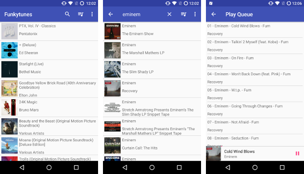

# Funkytunes



Funkytunes is a BitTorrent-based music app for Android, like Spotify or
Pandora. You can stream any music for free. The app is completely
open-source.

[](https://f-droid.org/repository/browse/?fdfilter=funkytunes&fdid=com.github.funkyg.funkytunes)

[Gitlab Mirror](https://gitlab.com/funkydev/funkytunes)

# How does it work?

The initial album list is simply fetched from the
[iTunes Album Charts](https://www.apple.com/itunes/charts/albums/).

The search functionality uses the [Discogs SearchAPI](https://www.discogs.com/).

After clicking an album, the app searches for `artist album` on
[ThePirateProxy](https://theproxypirate.pw) (limited to music). It then takes
the magnet link from the first search result, and downloads the torrent file.
Finally, the first mp3 file in the torrent is downloaded and played as soon
as its ready. Additional songs are downloaded on demand.

# Building

Funkytunes uses a standard Android build. Just install Android Studio and
Android SDK, import the project, and that's it!

For search, you need to register a
[Discogs account](https://www.discogs.com/developers/#page:authentication,header:authentication-discogs-auth-flow)
and enter the consumer key and consumer secret in
`app/src/main/assets/api_keys.txt` in the following form:

```
DISCOGS_API_KEY=your_key
DISCOGS_API_SECRET=your_secret
```

# License

Funkytunes is licensed under [GPLv3](LICENSE)
